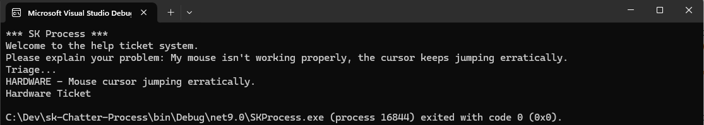

# Semantic Kernel - Chatter-Process

14 February 2025

## Overview

SK Process Framework Example.

1. Get user input
2. Triage : Software | Hardware | Security | Unsure 
3. If Security then get level of severity

## Configuration

Options in appsettings.json, should be self explanatory.
